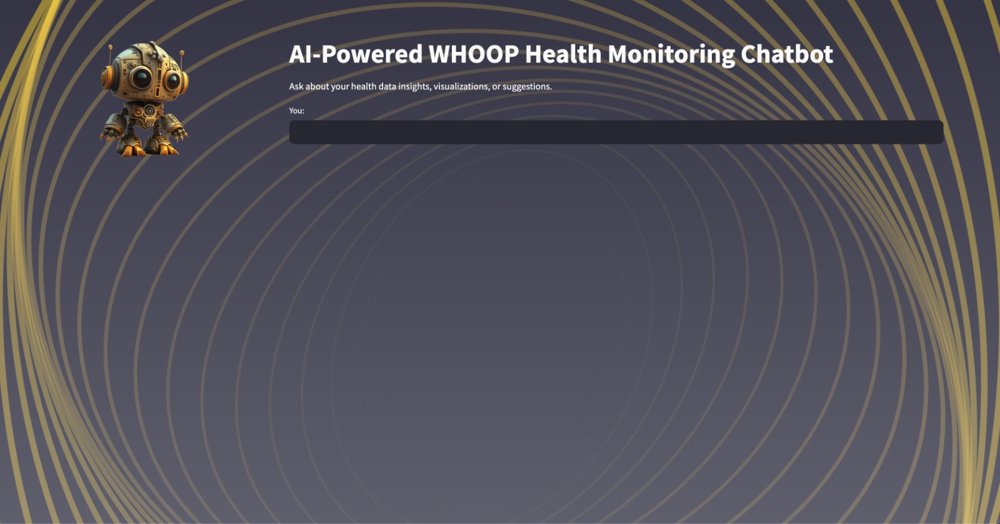
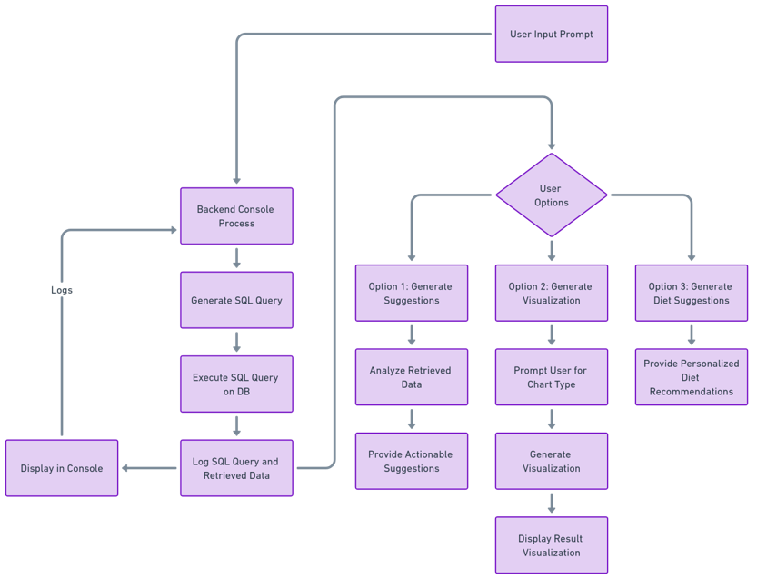
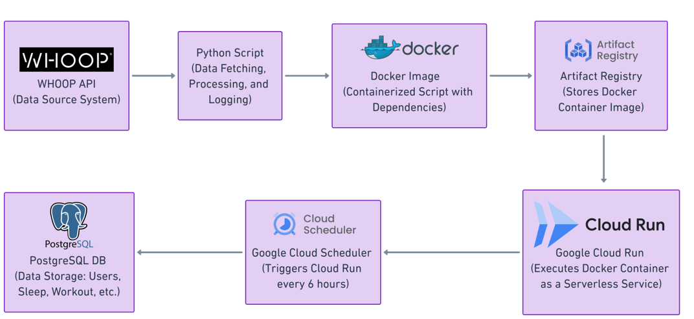
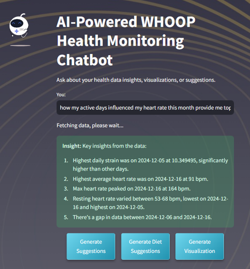
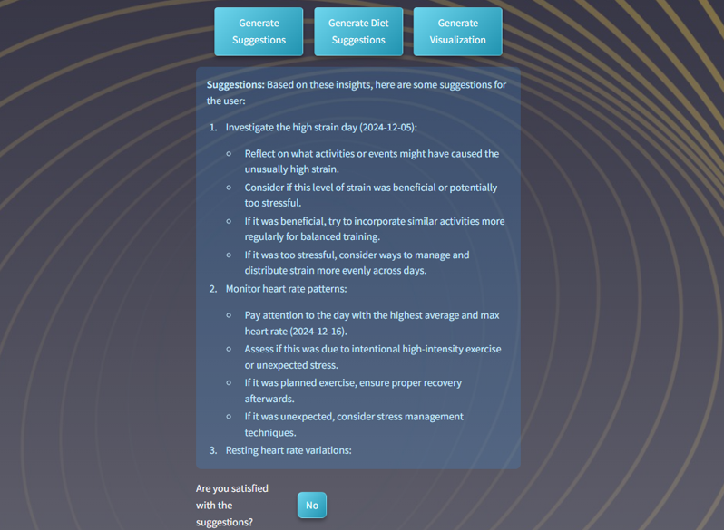
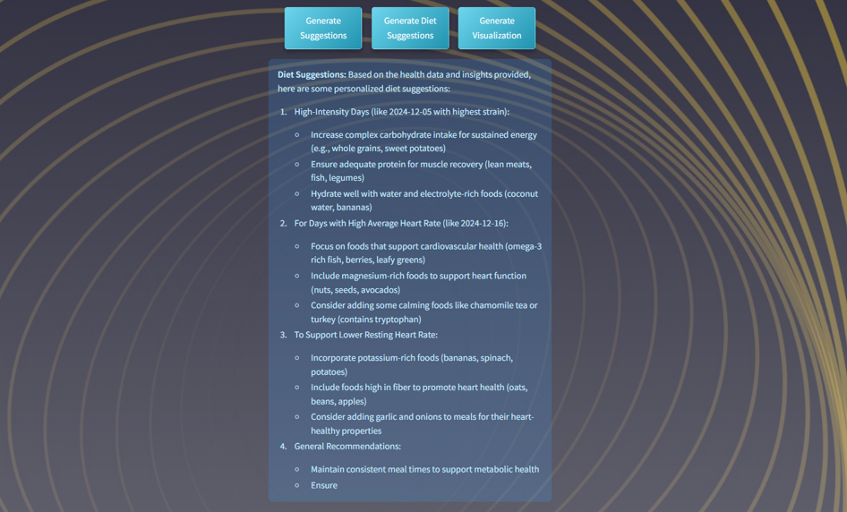
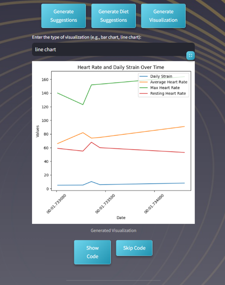

# AI-Powered Health Monitoring Chatbot

## Overview
This project provides an **AI-Powered Health Monitoring Chatbot** built using **Streamlit**, **Anthropic Claude AI**, **PostgreSQL**, and **Python visualizations**. The chatbot allows users to analyze their health data collected from **WHOOP wearable devices**, visualize trends, and receive actionable insights and diet recommendations.

Key functionalities include:

- Dynamic generation of SQL queries to retrieve user-specific health data.
- AI-powered insights and tailored recommendations.
- Interactive chatbot interface to query, visualize, and analyze health metrics.
- Automated data fetching from WHOOP APIs, processing, and storage into a PostgreSQL database.



---

## Features

### System Flow
The system follows a structured flow from data input to insights generation and visualization. Below is the complete flowchart of the system:



1. **User Input**:
   - Users interact with the chatbot through a Streamlit interface, entering queries or requesting visualizations.
2. **Backend Processing**:
   - Input prompts are processed to generate dynamic SQL queries for the PostgreSQL database.
   - Data retrieval and pre-processing occur based on the queries.
3. **Options Based on User Needs**:
   - **Option 1**: Generate actionable insights through Claude AI.
   - **Option 2**: Generate dynamic visualizations like bar charts or line graphs.
   - **Option 3**: Provide personalized diet and fitness suggestions.
4. **Output Generation**:
   - Results are displayed interactively on the Streamlit UI, with logs maintained for backend operations.

### Data Pipeline and Workflows

The project features a robust data pipeline to fetch, process, and utilize health data:

1. **Data Fetching**: Connects to the WHOOP API to retrieve user data, including sleep metrics, recovery scores, and workout details.
2. **Data Processing**:
   - Processes raw JSON responses from the WHOOP API.
   - Performs data validation and transformation for database storage.
3. **Data Storage**: Normalized tables in PostgreSQL for efficient querying and visualizations.
4. **Insights Generation**: AI-powered analysis using Claude AI to provide actionable recommendations.
5. **Visualization**: Generates dynamic plots and charts based on user queries.



### Data Fetching and Storage
- **WHOOP API Integration**: Fetches user profile, sleep data, recovery metrics, workout details, and body measurements.
- **PostgreSQL Storage**: Stores data into normalized database tables for efficient querying and analysis.
- **Deployment**: Hosted on **Google Cloud Run** for scalability.

### AI-Powered Insights
- **Claude AI Integration**: Processes health metrics and provides:
  - Summarized insights into user health trends.
  - Personalized suggestions for improvement.



  - GENERATING SUGGESTIONS
    
    
  - GENERATING DIET SUGGESTIONS
    
       
 
### Dynamic Visualizations
- **Matplotlib and Seaborn**: Generate bar charts, line graphs, and other visualizations dynamically based on user queries.
- **Examples**:
  - Line chart for heart rate trends over time.
  - Bar chart comparing sleep efficiency.



---

## Project Structure

### 1. WHOOP Data Fetch and Store System Script

```
WHOOP Data Fetch and Store System Script/
├── Logs/                                # Log files for debugging and tracking API requests
├── Readme                               # Documentation for the data fetch system
├── run_whoop_task.bat                   # Windows batch file for automating script execution
├── whoop_fetch_and_store(local run).py  # Python script for fetching data locally
├── whoop_fetch_and_store(for cloud deploy).py # Python script for cloud deployment

```

### 2. AI-Powered Health Monitoring Chatbot App

```
AI-Powered Health Monitoring Chatbot App/
├── assets/
│   ├── chatbot_image.png                # Image assets for the Streamlit UI
│   ├── background.jpg                   # Background image for the chatbot app
├── visualizations/                      # Auto-generated visualization files
├── chatbot_app.py                       # Main Streamlit application script
├── requirements.txt                     # Dependencies for both the chatbot and data fetching
├── Logs/                                # Shared log files
├── Readme                               # Main documentation file

```

---

## Setup Instructions

### Prerequisites
1. **Python 3.8+** installed on your machine.
2. **PostgreSQL** installed and configured.
3. WHOOP API credentials (username and password).
4. Claude AI API key from Anthropic.

### 1. Install Python Libraries
Run the following command to install all dependencies:
```bash
pip install -r requirements.txt
```

### 2. Set Up PostgreSQL Database
Create the required database and tables:
```sql
CREATE TABLE users (
    user_id VARCHAR PRIMARY KEY,
    first_name VARCHAR,
    last_name VARCHAR,
    email VARCHAR
);

CREATE TABLE body_measurements (
    user_id VARCHAR PRIMARY KEY,
    height_meter FLOAT,
    weight_kilogram FLOAT,
    max_heart_rate INT
);

CREATE TABLE cycle_data (
    cycle_id VARCHAR PRIMARY KEY,
    user_id VARCHAR,
    strain FLOAT,
    kilojoule FLOAT,
    average_heart_rate INT,
    max_heart_rate INT,
    created_at TIMESTAMP
);

CREATE TABLE recovery_data (
    cycle_id VARCHAR PRIMARY KEY,
    user_id VARCHAR,
    recovery_score FLOAT,
    resting_heart_rate FLOAT,
    hrv_rmssd_milli FLOAT,
    created_at TIMESTAMP
);

CREATE TABLE sleep_data (
    user_id VARCHAR,
    total_sleep_time INT,
    rem_sleep_time INT,
    deep_sleep_time INT,
    efficiency FLOAT,
    timestamp TIMESTAMP,
    nap BOOLEAN,
    respiratory_rate FLOAT
);

CREATE TABLE workout_data (
    workout_id VARCHAR PRIMARY KEY,
    user_id VARCHAR,
    start TIMESTAMP,
    strain FLOAT,
    kilojoule FLOAT,
    average_heart_rate FLOAT,
    max_heart_rate FLOAT,
    distance_meter FLOAT,
    created_at TIMESTAMP
);
```
Update `db_config` in the Python scripts with your PostgreSQL credentials:
```python
DB_CONFIG = {
    "database": "health_monitor_whoop",
    "user": "your_username",
    "password": "your_password",
    "host": "your_host",
    "port": "5432"
}
```

### 3. Configure WHOOP API and Claude AI
Replace placeholders in `whoop_fetch_and_store.py` and `chatbot_app.py` with your credentials:
```python
USERNAME = "your_email@example.com"
PASSWORD = "your_password"
API_KEY = "your_anthropic_api_key"
```

---

## How to Run

### 1. Fetch and Store WHOOP Data
Run the `whoop_fetch_and_store.py` script to fetch data and store it in the PostgreSQL database:
```bash
python whoop_fetch_and_store.py
```

### 2. Start the Chatbot
Run the Streamlit application:
```bash
streamlit run chatbot_app.py
```
Open the provided URL (e.g., `http://localhost:8501`) in your web browser to interact with the chatbot.

---

## Example Queries

### Health Insights
- "What was my average heart rate on the 5 most active days?"
- "Did I get enough sleep this week?"
- "How did my deep sleep change during my 5 most active days?"

### Recommendations
- "What diet suggestions can you give me for my health trends?"
- "How can I improve my recovery scores?"

### Visualizations
- "Show me a bar chart of my recovery scores over the past month."
- "Visualize my heart rate trends."

---

## Example Outputs
### Logs
```
[INFO] Authenticating with WHOOP API...
[INFO] Authenticated successfully! User ID: 12345678
[INFO] Fetching sleep data...
[INFO] Storing sleep data...
[INFO] WHOOP data fetch and store process completed successfully!
```

### Database Verification
Example SQL query:
```sql
SELECT * FROM cycle_data LIMIT 5;
```


---

## Troubleshooting

### Common Issues
1. **Database Connection Error**:
   - Verify PostgreSQL credentials and ensure the database is running.

2. **API Authentication Failure**:
   - Check your WHOOP or Claude AI credentials.

3. **Visualization Errors**:
   - Ensure data columns are correctly formatted.

4. **Missing Libraries**:
   - Install dependencies using:
     ```bash
     pip install -r requirements.txt
     ```


## License
This project is licensed under the MIT License.
